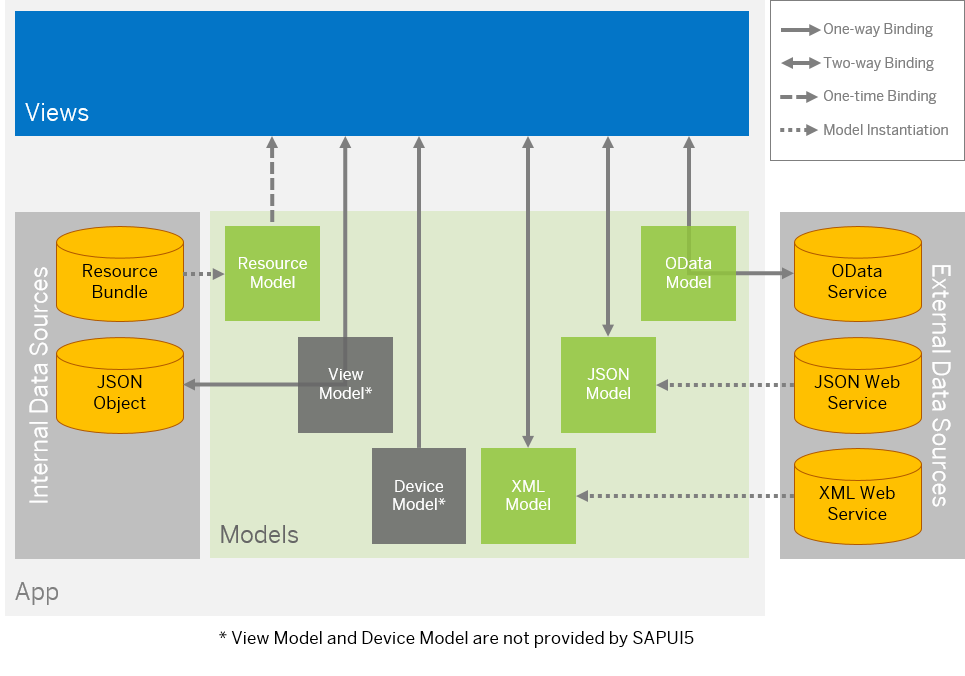

<!-- loio68b9644a253741e8a4b9e4279a35c247 -->

| loio |
| -----|
| 68b9644a253741e8a4b9e4279a35c247 |

view on: [demo kit nightly build](https://openui5nightly.hana.ondemand.com/#/topic/68b9644a253741e8a4b9e4279a35c247) | [demo kit latest release](https://openui5.hana.ondemand.com/#/topic/68b9644a253741e8a4b9e4279a35c247)

## Data Binding

You use data binding to bind UI elements to data sources to keep the data in sync and allow data editing on the UI.

***

-   [Views](Views_91f27e3.md)
-   [Models](Models_e1b6259.md)
-   [Resource Bundles](Resource_Bundles_91f225c.md)

OpenUI5 follows the "Model View Controller" \(MVC\) paradigm, which means that we clearly separate data sources \(model\), UI \(view\), and application logic \(controller\) from each other. Data binding defines how models and views communicate with each other.

Depending on which external data source you use, you can choose between different model types to represent it. OpenUI5 supports OData V4 \(with restrictions\), OData V2, JSON, and XML models.

There are also internal data sources that are defined in the app for specific purposes. For those, an app contains the following models:

-   The **resource model** is used in communication with the resource bundle that contains translatable texts in multiple languages.

-   The **device model** is provided by the framework and defines device-specific settings.

-   **View models** can be, for example, JSON models that communicate with a corresponding JSON object. JSON data can also be edited in the app, but they are not stored - as soon as you refresh the browser or restart the app, the changes are reset.

Most of the models are client-side models. This means that all data is initially loaded to the model when the app is started. All actions performed on the data are only executed on the client, and are only sent back to the data source when this is triggered by the app. Client-side models are therefore only recommended for small data sets.

The OData models \(V2 and V4\) are server-side models, which means that data is provided by a back-end system on demand. Filtering, sorting, and paging actions are performed on the server. This means, for example, that you don't have to load a complete table on the UI to be able to sort the entries.

In the view, you bind data by specifying the **binding path** for a control. You can use **data types** and **formatters** to validate and format the data on the UI.

> Note:
> To learn more about data binding, take this tutorial: [Data Binding](Data_Binding_e531093.md).
> 
> 

***

<a name="loio68b9644a253741e8a4b9e4279a35c247__section_BindingModes"/>

### Binding Modes: One-way Binding, Two-way Binding, and One-time Binding

The binding mode defines how the data sources are bound to the UI. OpenUI5 provides the following binding modes:

-   **One-way binding** means a binding from the model to the view. Any value changes in the model update all corresponding bindings and the view.

-   **Two-way binding** means a binding from the model to the view and from the view to the model. Any changes in the model or the view fire events that automatically trigger updates of all corresponding bindings and both the view and the model.

    > Note:
    > Two-way binding is currently only supported for property bindings. For other binding types, such as list bindings, the creation or deletion of entities depends on the specific model.
    > 
    > **Example:** For list bindings the OData V4 model provides the [`sap.ui.model.odata.v4.ODataListBinding#create` method](https://openui5.hana.ondemand.com/#/api/sap.ui.model.odata.v4.ODataListBinding/methods/create) for creating a new entity, and the [`sap.ui.model.odata.v4.Context#delete` method](https://openui5.hana.ondemand.com/#/api/sap.ui.model.odata.v4.Context/methods/delete) to delete an entity in a list. 
    > 
    > For more information on the different types of binding available, see [Binding Types](Binding_Types_91f0d8a.md).
    > 
    > 

    > Note:
    > When using formatter functions, the binding is automatically switched to "one-way". So you can’t use a formatter function for "two-way" scenarios, but you can use [Data Types](Formatting,_Parsing,_and_Validating_Data_07e4b92.md#loio07e4b920f5734fd78fdaa236f26236d8__section_DataTypes).
    > 
    > 

-   **One-time binding** means from model to view once.

The following table shows which binding modes are supported by the respective data models within OpenUI5:

|Model|One-time|One-way|Two-way|
|-----|--------|-------|-------|
|OData V4 model|  |  |  \(default\)|
|OData V2 model|  |  \(default\)|  |
|ODataMetaModel V4|  \(default\)|  |  |
|ODataMetaModel|  \(default\)|  |  |
|JSON model|  |  |  \(default\)|
|XML model|  |  |  \(default\)|
|Resource model|  |  \(default\)|  |

For more information, see the [API Reference: `sap.ui.model.BindingMode`](https://openui5.hana.ondemand.com/#docs/api/symbols/sap.ui.model.BindingMode.html). 

