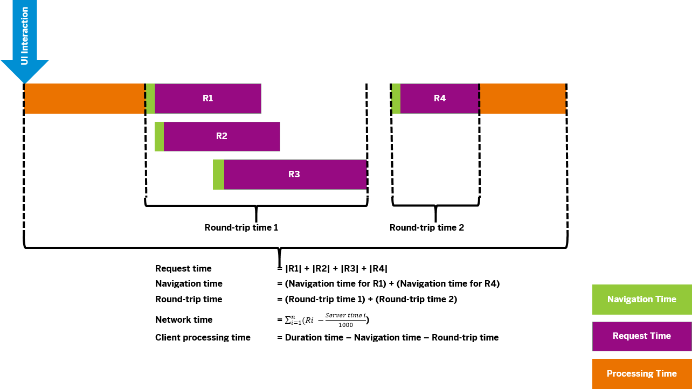

<!-- loiob2825eabd7bb43d79b475fee4194c609 -->

| loio |
| -----|
| b2825eabd7bb43d79b475fee4194c609 |

<div id="loio">

view on: [demo kit nightly build](https://openui5nightly.hana.ondemand.com/#/topic/b2825eabd7bb43d79b475fee4194c609) | [demo kit latest release](https://openui5.hana.ondemand.com/#/topic/b2825eabd7bb43d79b475fee4194c609)</div>

## Interaction Tracking for Performance Measurement

You can analyze the performance of your UI5 application by tracking the interaction that is performed on the UI.

Interaction in this context means a closed step in a sequence of actions that a user performs on the UI, for example, everything that happens between two clicks on two different buttons. The interaction tracking considers XHRs, loadings triggered via script tags and rendering aspects.

To **start** interaction tracking, use `Interaction.setActive(true)` from module `sap/ui/performance/trace/Interaction`. To map the interaction data to the data of `sap/ui/performance/Measurement`, you have to explicitly set `sap-ui-measure=true`.

To **retrieve** the result of the interaction measurement, use `Interaction.getAll()` from module `sap/ui/performance/trace/Interaction`. This returns an array of all interactions that occurred and their measurement.

You can use `Interaction.filter` from module `sap/ui/performance/trace/Interaction` to filter the interaction measurements according to a filter function \(`fnFilter`\).

***

### Example of an Interaction Measurement

``` js
InteractionMeasurement = {
    id: uid()                   // interaction ID
    event: "click",             // event which triggered interaction - default is startup interaction
    trigger: "Button1",         // element ID
    component: "my.Component",  // component or app identifier
    start : 0,                  // interaction start
    end: 0,                     // interaction end
    navigation: 0,              // sum over all navigation times
    roundtrip: 0,               // time from first request sent to last received response end - without gaps and ignored overlap
    processing: 0,              // client processing time
    duration: 0,                // interaction duration
    requests: [],               // all requests (XHRs) that occured during the interaction
    measurements: [],           // sap/ui/performance/Measurement measurements
    sapStatistics: [],          // SAP Statistics for OData
    requestTime: 0,             // sum over all requests in the interaction
    networkTime: 0,             // request time minus server time from the sap-perf-fesrec header
    bytesSent: 0,               // sum over all requests bytes
    bytesReceived: 0,           // sum over all response bytes
    requestCompression: false,  // true if all responses have been sent gzipped - default is undefined
    busyIndication: 0           // summed BusyIndicator duration during this interaction
}
```

***

### Properties of Interaction Measurements


<table>
<tr>
<th>

Property


</th>
<th>

Type


</th>
<th>

Description


</th>
</tr>
<tr>
<td>

 `id` 


</td>
<td>

 `sap/base/util/uid` 


</td>
<td>

Interaction ID


</td>
</tr>
<tr>
<td>

 `event` 


</td>
<td>

 `String` 


</td>
<td>

Event type which triggered the interaction. Allowed types are:

-   `mousedown`

-   `mouseup`

-   `click`

-   `keydown`

-   `keyup`

-   `keypress`

-   `touchstart`

-   `touchend`

-   `tap`

-   `mousewheel`

-   `scroll`


</td>
</tr>
<tr>
<td>

 `trigger` 


</td>
<td>

 `String` 


</td>
<td>

ID of the element that triggered the action


</td>
</tr>
<tr>
<td>

 `component` 


</td>
<td>

 `String` 


</td>
<td>

ID of the app or name of the Component that contains the triggering element


</td>
</tr>
<tr>
<td>

 `appVersion` 


</td>
<td>

 `String` 


</td>
<td>

Application version as from App Descriptor


</td>
</tr>
<tr>
<td>

 `start` 


</td>
<td>

 `Number` 


</td>
<td>

Interaction start; always triggered by user interaction. From that point in time \(timestamp\), all information about request timings, rendering, etc. is collected.


</td>
</tr>
<tr>
<td>

 `end` 


</td>
<td>

 `Number` 


</td>
<td>

Interaction end; defined as start time plus duration.


</td>
</tr>
<tr>
<td>

 `navigation` 


</td>
<td>

 `Number` 


</td>
<td>

Navigation time for all requests, calculated as difference from `startTime` to `connectEnd` of a `PerformanceTiming` \(in ms\)

Requests that are started while another request is already in progress are ignored \(see figure below\).


</td>
</tr>
<tr>
<td>

 `roundtrip` 


</td>
<td>

 `Number` 


</td>
<td>

Roundtrip time for a request, calculated as difference from `requestStart` to `responseEnd` of a `PerformanceTiming` \(in ms\)


</td>
</tr>
<tr>
<td>

 `processing` 


</td>
<td>

 `Number` 


</td>
<td>

The client processing time \(in ms\) of an interaction, calculated by subtracting the navigation time for all requests and the sum of roundtrip times from the total processing duration.


</td>
</tr>
<tr>
<td>

 `duration` 


</td>
<td>

 `Number` 


</td>
<td>

The duration time \(in ms\) of an interaction including navigation and request times, calculated by subtracting the interaction start time from the interaction end time.


</td>
</tr>
<tr>
<td>

 `requests` 


</td>
<td>

 `PerformanceTiming[]` 


</td>
<td>

All requests that occurred during the interaction, taken from the `NavigationTiming` API


</td>
</tr>
<tr>
<td>

 `measurements` 


</td>
<td>

 `Measurement[]` 


</td>
<td>

Performance measurements \(see [Performance Measurement Using sap/ui/performance/Measurement Module](Performance_Measurement_Using_sapuiperformanceMeasurement_Module_78880c0.md)\)


</td>
</tr>
<tr>
<td>

 `sapStatistics` 


</td>
<td>

 `Object[]` 


</td>
<td>

Map of request URL to corresponding `sap-statistics` header as String \( format: `{ url: "https://somehost.com/sap/data...", statistics: "total=167,fw=167,app=0,gwtotal=167,gwhub=160,gwrfcoh=0,gwbe=7,gwapp=0,gwnongw=0" }`\)


</td>
</tr>
<tr>
<td>

 `requestTime` 


</td>
<td>

 `Number` 


</td>
<td>

Sum over all request durations of this interaction, from `startTime` to `responseEnd` \(in ms\)


</td>
</tr>
<tr>
<td>

 `networkTime` 


</td>
<td>

 `Number` 


</td>
<td>

Average network time per request \(in ms\) that occurred during the interaction. Calculated using the `sap-perf-fesrec` header sent by the back end with each response; a network time of zero results if no header is available.


</td>
</tr>
<tr>
<td>

 `bytesSent` 


</td>
<td>

 `Number` 


</td>
<td>

Sum over all bytes sent with requests \(content plus headers\)


</td>
</tr>
<tr>
<td>

 `bytesReceived` 


</td>
<td>

 `Number` 


</td>
<td>

Sum over all bytes received with responses \(content plus headers\)


</td>
</tr>
<tr>
<td>

 `requestCompression` 


</td>
<td>

 `Boolean` 


</td>
<td>

Indicates if all requests during an interaction have been received in GNU zip format \("gzipped"\)


</td>
</tr>
<tr>
<td>

 `busyDuration` 


</td>
<td>

 `Number` 


</td>
<td>

Time during which a `BusyIndicator` was rendered and hence blocking the UI during an interaction


</td>
</tr>
</table>

***

### Calculation of Times



**Related Information**  


[API Reference: `sap/ui/performance/Measurement`](https://openui5.hana.ondemand.com/#/api/module:sap/ui/performance/Measurement)

[Performance Measurement Using sap/ui/performance/Measurement Module](Performance_Measurement_Using_sapuiperformanceMeasurement_Module_78880c0.md)

[`NavigationTiming` API on `https://developer.mozilla.org`](https://developer.mozilla.org/en/docs/Web/API/Navigation_timing_API)

[Navigation Timing on `https://www.w3.org/`](https://www.w3.org/TR/2012/REC-navigation-timing-20121217)

