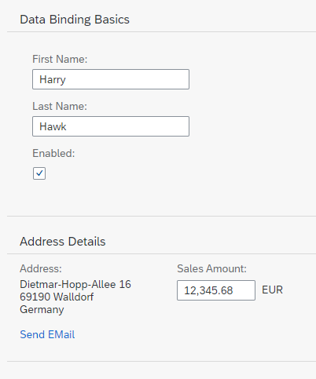

<!-- loio9252ee4015f24fc49c71c295394d1b8d -->

| loio |
| -----|
| 9252ee4015f24fc49c71c295394d1b8d |

<div id="loio">

view on: [demo kit nightly build](https://openui5nightly.hana.ondemand.com/#/topic/9252ee4015f24fc49c71c295394d1b8d) | [demo kit latest release](https://openui5.hana.ondemand.com/#/topic/9252ee4015f24fc49c71c295394d1b8d)</div>

## Step 10: Property Formatting Using Data Types

OpenUI5 provides a set of simple data types such as `Boolean`, `Currency`, `Date` and `Float`. These data types can then be applied to controls in order to ensure that the value presented on the screen is formatted correctly, and, if the field is open for input, that the value entered by the user adheres to the requirements of that data type. We will now add a new field called *Sales Amount* of type `Currency`.

***

### Preview

   
  
New *Sales Amount* input field <a name="loio9252ee4015f24fc49c71c295394d1b8d__fig_r1j_pst_mr"/>

  

***

### Coding

You can view and download all files in the Demo Kit at [Data Binding - Step 10](https://openui5.hana.ondemand.com/explored.html#/sample/sap.ui.core.tutorial.databinding.10/preview).

***

### webapp/index.js

``` js
sap.ui.require([
	"sap/ui/model/json/JSONModel",
	"sap/ui/core/mvc/XMLView",
	"sap/ui/model/resource/ResourceModel"
], function (JSONModel, XMLView, ResourceModel) {
	"use strict";

	// Attach an anonymous function to the SAPUI5 'init' event
	sap.ui.getCore().attachInit(function () {
		var oModel = new JSONModel({
			firstName: "Harry",
			lastName: "Hawk",
			enabled: true,
			address: {
				street: "Dietmar-Hopp-Allee 16",
				city: "Walldorf",
				zip: "69190",
				country: "Germany"
			}*HIGHLIGHT START*,
			salesAmount: 12345.6789,
			currencyCode: "EUR"
*HIGHLIGHT END*
		});

		// Assign the model object to the SAPUI5 core
		sap.ui.getCore().setModel(oModel);

		var oResourceBundle = new ResourceModel({
			bundleName: "sap.ui.demo.db.i18n.i18n"
		});

		sap.ui.getCore().setModel(oResourceBundle, "i18n");

		// Display the XML view called "App"
		new XMLView({
			viewName: "sap.ui.demo.db.view.App"
		}).placeAt("content");
	});
});

```

We create two new model properties `salesAmount` and `currencyCode`.

***

### webapp/view/App.view.xml

``` xml
...
	<Panel headerText="{i18n>panel1HeaderText}" class="sapUiResponsiveMargin" width="auto">
		<form:SimpleForm editable="true" layout="ColumnLayout">
			<Label text="{i18n>firstName}"/>
			<Input value="{/firstName}" valueLiveUpdate="true" width="200px" enabled="{/enabled}"/>
			<Label text="{i18n>lastName}"/>
			<Input value="{/lastName}" valueLiveUpdate="true" width="200px" enabled="{/enabled}"/>
			<Label text="{i18n>enabled}"/>
			<CheckBox selected="{/enabled}"/>
		</form:SimpleForm>
	</Panel>
	<Panel headerText="{i18n>panel2HeaderText}" class="sapUiResponsiveMargin" width="auto">
		<content>
			<l:HorizontalLayout>
				<l:VerticalLayout>
					<Label labelFor="address" text="{i18n>address}:"/>
					<FormattedText class="sapUiSmallMarginBottom"
						htmlText="{/address/street}&lt;br&gt;{/address/zip} {/address/city}&lt;br&gt;{/address/country}"
						id="address" width="200px"/>
					<Link href="{
							parts: [
								'/firstName',
								'/lastName'
							],
							formatter: '.formatMail'
						}"
						text="{i18n>sendEmail}"/>
				</l:VerticalLayout>
*HIGHLIGHT START*				<l:VerticalLayout>
					<Label labelFor="salesAmount" text="{i18n>salesAmount}:"/>
					<Input description="{/currencyCode}" enabled="{/enabled}" id="salesAmount"
						value="{
							parts: [
								{path: '/salesAmount'},
								{path: '/currencyCode'}
							],
							type: 'sap.ui.model.type.Currency',
							formatOptions: {showMeasure: false}
						}" width="200px"/>
				</l:VerticalLayout>*HIGHLIGHT END*
			</l:HorizontalLayout>
		</content>
	</Panel>
</mvc:View>
```

A new pair of `Label` and `Input` elements have been created for the `salesAmount` model property. The description property of the `Input` element has been bound to the `currencyCode` model property. The value property of the `Input` element has been bound to the model properties `salesAmount` and `currencyCode`. The `{showMeasure: false}` parameter switches off the display of the currency symbol within the input field itself. This is not needed because it is being displayed using the `Input` element's description property.

***

### webapp/i18n/i18n.properties

``` prefs
# Field labels
firstName=Vorname
lastName=Nachname
enabled=Enabled
address=Address
*HIGHLIGHT START*salesAmount=Sales Amount*HIGHLIGHT END*...
```

***

### webapp/i18n/i18n\_de.properties

``` prefs
# Field labels
firstName=Vorname
lastName=Nachname
enabled=Aktiviert
address=Adresse
*HIGHLIGHT START*salesAmount=Verk\\u00e4ufe bis zum heutigen Datum*HIGHLIGHT END*
...
```

Add the missing texts to the `properties` files. Please note that special characters \(non-Latin-1\) have to be entered by using Unicode escape characters.

**Related information**  


[Formatting, Parsing, and Validating Data](Formatting,_Parsing,_and_Validating_Data_07e4b92.md)

