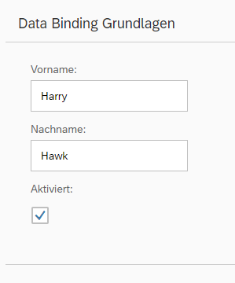

<!-- loio4e593b44e78a431e8b21be6b3915fb55 -->

| loio |
| -----|
| 4e593b44e78a431e8b21be6b3915fb55 |

<div id="loio">

view on: [demo kit nightly build](https://openui5nightly.hana.ondemand.com/#/topic/4e593b44e78a431e8b21be6b3915fb55) | [demo kit latest release](https://openui5.hana.ondemand.com/#/topic/4e593b44e78a431e8b21be6b3915fb55)</div>

## Step 7: \(Optional\) Resource Bundles and Multiple Languages

The reason we have resource bundles is to allow an app to run in multiple languages without the need to change any code. To demonstrate this feature, we will create a German version of the app – in fact all we need to do is create a German version of the resource bundle file. In our code, the German locale needs to be activated for the ResourceModel.

***

### Preview

   
  
<a name="loio4e593b44e78a431e8b21be6b3915fb55__fig_r1j_pst_mr"/>German version of our UI

  

***

### Coding

You can view and download all files in the Demo Kit at [Data Binding - Step 7](https://openui5.hana.ondemand.com/explored.html#/sample/sap.ui.core.tutorial.databinding.07/preview).

***

<a name="loio4e593b44e78a431e8b21be6b3915fb55__section_stj_zdp_2mb"/>

### webapp/i18n/i18n\_de.properties \(New\)

``` prefs
# Field labels
firstName=*HIGHLIGHT START*Vorname*HIGHLIGHT END*
lastName=*HIGHLIGHT START*Nachname*HIGHLIGHT END*
enabled=*HIGHLIGHT START*Aktiviert*HIGHLIGHT END*

# Screen titles
panelHeaderText=*HIGHLIGHT START*Data Binding Grundlagen*HIGHLIGHT END*
```

In the `i18n` folder, make a copy of the file `i18n.properties` and call it `i18n**\_de**.properties`. The suffix `de` is the locale for German language. Change the English text to the German text. Then, add the new locale `de` to the `supportedLocales` configuration, so that it will be taken into account:

***

<a name="loio4e593b44e78a431e8b21be6b3915fb55__section_ttj_zdp_2mb"/>

### webapp/index.js

``` js
sap.ui.require([
	"sap/ui/model/json/JSONModel",
	"sap/ui/core/mvc/XMLView",
	"sap/ui/model/resource/ResourceModel"
], function (JSONModel, XMLView, ResourceModel) {
	"use strict";

	// Attach an anonymous function to the SAPUI5 'init' event
	sap.ui.getCore().attachInit(function () {
		// Create a JSON model from an object literal
		var oModel = new JSONModel({
			firstName: "Harry",
			lastName: "Hawk",
			enabled: true
		});

		// Assign the model object to the SAPUI5 core
		sap.ui.getCore().setModel(oModel);

		// Create a resource bundle for language-specific texts
		// the configured supportedLocales represent the i18n files present:
		// * "" - i18n/i18n.properties
		// * "de" - i18n/i18n_de.properties
		// a configured fallbackLocale should represent one of these files
		// * "" - according to the fallback chain, the root bundle is the last fallback
		//   which means that if "de" was requested here, the root bundle would never be loaded.
		//   Configuring it explicitly avoids side effects when additional resource files are added.
		// @see https://openui5.hana.ondemand.com/#/topic/ec753bc539d748f689e3ac814e129563
		var oResourceModel = new ResourceModel({
			*HIGHLIGHT START*bundleName: "sap.ui.demo.db.i18n.i18n",
			supportedLocales: ["", "de"],
			fallbackLocale: ""*HIGHLIGHT END*
		});

		// Assign the model object to the SAPUI5 core using the name "i18n"
		sap.ui.getCore().setModel(oResourceModel, "i18n");

		// Display the XML view called "App"
		new XMLView({
			viewName: "sap.ui.demo.db.view.App"
		}).placeAt("content");
	});
});

```

To test the outcome, change the default language of your browser to German and refresh your preview.

**Related Information**  


[Localization](Localization_91f217c.md)

