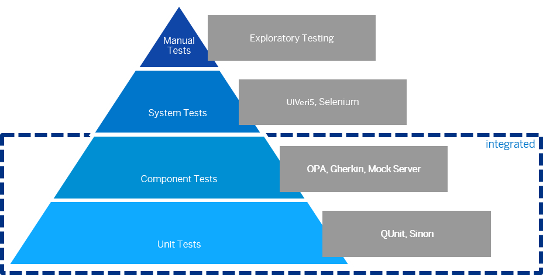

<!-- loio7cdee404cac441888539ed7bfe076e57 -->

| loio |
| -----|
| 7cdee404cac441888539ed7bfe076e57 |

view on: [demo kit nightly build](https://openui5nightly.hana.ondemand.com/#/topic/7cdee404cac441888539ed7bfe076e57) | [demo kit latest release](https://openui5.hana.ondemand.com/#/topic/7cdee404cac441888539ed7bfe076e57)

## Testing

OpenUI5 provides several testing options, like to unit and integration tests and the mock server.

Before you start implementing your first test, you should think about how to test the different aspects of your application. The image below shows some examples of testing tools along the agile testing pyramid.

   
  
Testing pyramid<a name="loio7cdee404cac441888539ed7bfe076e57__fig_u2g_t2y_2t"/>

  

You can use a local test runner, such as Selenium or Karma, that automatically executes all tests whenever a file in the app project has been changed.

**Related information**  

[Tutorial: Testing](Testing_291c912.md)

[Continuous Integration: Ensure Code Quality](Continuous_Integration_Ensure_Code_Quality_fe7a158.md)

[Selenium Home Page](http://docs.seleniumhq.org/)

[Karma Home Page](https://www.npmjs.com/package/karma)

