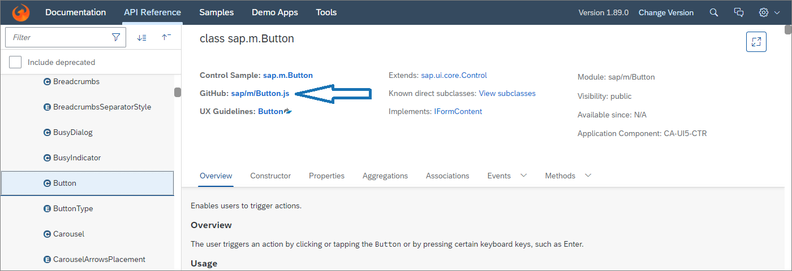

<!-- loio08050365ef9f4777af7b3c139fdb0d82 -->

| loio |
| -----|
| 08050365ef9f4777af7b3c139fdb0d82 |

view on: [demo kit nightly build](https://openui5nightly.hana.ondemand.com/#/topic/08050365ef9f4777af7b3c139fdb0d82) | [demo kit latest release](https://openui5.hana.ondemand.com/#/topic/08050365ef9f4777af7b3c139fdb0d82)

## What's New in OpenUI5 1.89

With this release OpenUI5 is upgraded from version 1.88 to 1.89.

***

<a name="loio08050365ef9f4777af7b3c139fdb0d82__section_r5v_3h5_zcb"/>

### Demo Kit Feedback

|**Demo Kit Improvements**

Here are some Demo Kit improvements that we implemented based on your feedback:

-   You can now quickly cancel the global search by pressing [Esc\].

-   We implemented a copy button in all code samples in the *Documentation* section:

-   We added a link for each API in the Demo Kit and you can now go directly to the source code file in GitHub:

|

***

<a name="loio08050365ef9f4777af7b3c139fdb0d82__section_qwl_pb5_zcb"/>

### Improved Features

|**OpenUI5 OData V2 Model**

You can now provide unit and currency customizing for the `sap.ui.model.odata.type.Unit` and `sap.ui.model.odata.type.Currency` data types as part of the data service. For more information, see [Currency and Unit Customizing in OData V2](OData_V2_Model_6c47b2b.md#loioaa9024c7c5444822a68daeb21a92bd51).

|
|**OpenUI5 OData V4 Model**

Additional targets are now supported for [server messages](Server_Messages_in_the_OData_V4_Model_fbe1cb5.md).

|
|**OpenUI5 Data Types**

The `preserveDecimals` format option introduced in `sap.ui.core.format.NumberFormat` with OpenUI5 1.87 is now enabled by default, unless the `style` format option is set to either `short` or `long`. This applies to the following data types:

-   `sap.ui.model.type.Currency`
-   `sap.ui.model.type.Float`
-   `sap.ui.model.type.Unit`
-   `sap.ui.model.odata.type.Currency`
-   `sap.ui.model.odata.type.Decimal`
-   `sap.ui.model.odata.type.Double`
-   `sap.ui.model.odata.type.Single`
-   `sap.ui.model.odata.type.Unit`

This change fixes the shortcoming that displayed values can be truncated if the back end provides more decimals than accounted for on the UI. It is also a prerequisite for highlighting all instances of invalid data entered by the user if the same property is displayed in multiple places on the UI.

However, in some cases it can be necessary to display a value with fewer decimals than actually exist for the property. You would then need to add the `preserveDecimals` format option with a value of `false` to the type instance.

|

***

<a name="loio08050365ef9f4777af7b3c139fdb0d82__section_rqn_wd5_zcb"/>

### Improved Controls

|**`sap.m.Link`, `sap.m.ObjectIdentifier`, `sap.m.ObjectNumber`, `sap.m.ObjectStatus`, and `sap.ui.unified.Currency`**

Similar to the `sap.m.Text` control, these controls now also implement the new `emptyIndicatorMode` property. It allows developers to display an empty text as a language dependent “-” symbol.

|
|**`sap.ui.layout.form.Form`, `sap.ui.layout.form.SimpleForm`**

You can now define up to six columns in extra-large size in a form. For more information, see the [API Reference](https://openui5.hana.ondemand.com/#/api/sap.ui.layout.form.ColumnsXL), the [Samples](https://openui5.hana.ondemand.com/#/entity/sap.ui.layout.form.Form) for `Form`, and the [Samples](https://openui5.hana.ondemand.com/#/entity/sap.ui.layout.form.SimpleForm) for `SimpleForm`.

|

