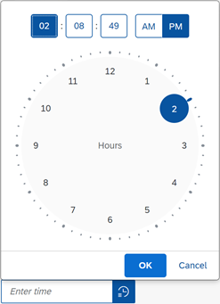

<!-- loiob47520229109430cba291b5290848c08 -->

| loio |
| -----|
| b47520229109430cba291b5290848c08 |

view on: [demo kit nightly build](https://openui5nightly.hana.ondemand.com/#/topic/b47520229109430cba291b5290848c08) | [demo kit latest release](https://openui5.hana.ondemand.com/#/topic/b47520229109430cba291b5290848c08)

## What's New in OpenUI5 1.90

With this release OpenUI5 is upgraded from version 1.89 to 1.90.

***

<a name="loiob47520229109430cba291b5290848c08__section_bkm_s15_zcb"/>

### New Controls

<table>
<tr>
<td>

**`sap.m.NotificationList`**

The control provides a container for `sap.m.NotificationListGroup` and `sap.m.NotificationListItem` items where this control should be used, instead of `sap.m.List`. While the `sap.m.List` is still working properly, we strongly recommend you to use the new `sap.m.NotificationList` control in order to benefit from the accessibility features that are built-in. For more information, see the [API Reference](https://openui5.hana.ondemand.com/#/api/sap.m.NotificationList).

</td>
</tr>
</table>

***

<a name="loiob47520229109430cba291b5290848c08__section_qwl_pb5_zcb"/>

### Improved Features

<table>
<tr>
<td>

**One Page Acceptance Tests \(OPA5\)**

You can now simulate scroll in controls that provide a scrollable area. For more information, see [Simulating User Interactions on Controls](Simulating_User_Interactions_on_Controls_8615a0b.md).

</td>
</tr>
</table>

***

<a name="loiob47520229109430cba291b5290848c08__section_rqn_wd5_zcb"/>

### Improved Controls

<table>
<tr>
<td>

**`sap.f.IllustratedMessage` \(Experimental\)**

We have implemented two new samples for specific scenarios:

-   The first sample is useful for apps that have user sign in and use a mechanism for automated sign out as a result of inactivity over a predefined period of time. The period of inactivity can vary between 5 to 60 minutes. A session timeout dialog appears automatically to inform the user.For more information, see the [sample](https://openui5.hana.ondemand.com/#/entity/sap.f.IllustratedMessage/sample/sap.f.sample.IllustratedMessageSessionTimeout).

-   The second sample demonstrates the TNT Illustration Set where you can preview the illustration types in the different illustration sizes.For more information, see the [sample](https://openui5.hana.ondemand.com/#/entity/sap.f.IllustratedMessage/sample/sap.f.sample.IllustratedMessageInPageTNT).

</td>
</tr>
<tr>
<td>

**`sap.gantt`**

Key users can now use the new customization feature to make changes to the user interface of a Gantt chart as per their requirements.

 For more information, see the [API Reference](https://openui5.hana.ondemand.com/sdk/#/api/sap.gantt.simple.GanttChartWithTable). 

</td>
</tr>
<tr>
<td>

**`sap.m.Dialog`**

The control adopts the `setWithinArea` feature of `sap.ui.core.Popup`. Now, when a custom within area is set, the dialog is centered inside it, and cannot be dragged or resized out of this area. For more information, see the [API Reference](https://openui5.hana.ondemand.com/#/api/sap.ui.core.Popup/methods/sap.ui.core.Popup.setWithinArea) and the [Sample](https://openui5.hana.ondemand.com/#/entity/sap.m.Dialog/sample/sap.m.sample.DialogWithinArea). 

</td>
</tr>
<tr>
<td>

**`sap.m.IconTabBar`**

We have introduced a new `TabsOverflowMode` property, which defines the overflow behavior of the control. Now, application developers can choose whether to display the overflow tabs at the `End` \(default\) of the Icon Tab Bar, or alternatively at `StartAndEnd` - with two overflows on both ends of the bar. Usage of the property with `StartAndEnd` value is recommended for scenarios, where the order of the tabs is important; for example, when the tabs represent process steps. For more information, see the [API Reference](https://openui5.hana.ondemand.com/#/api/sap.m.IconTabBar) and the [Sample](https://openui5.hana.ondemand.com/#/entity/sap.m.IconTabBar/sample/sap.m.sample.IconTabBarStartAndEndOverflow).

</td>
</tr>
<tr>
<td>

**`sap.m.Input`, `sap.m.MultiInput`**

We have introduced a new property called `enableTableAutoPopinMode`. The property is responsible for enabling the auto popin mode of the `sap.m.Table` when we have an input with tabular suggestions. For more information, see the [API Reference](https://openui5.hana.ondemand.com/#/api/sap.m.Input) and the [Samples](https://openui5.hana.ondemand.com/#/entity/sap.m.Input).

</td>
</tr>
<tr>
<td>

**`sap.m.InputBase`**

We have introduced a new association called `ariaDescribedBy`. The association is responsible for referencing the elements that describe the control. For more information, see the [API Reference](https://openui5.hana.ondemand.com/#/api/sap.m.InputBase) and the [Sample](https://openui5.hana.ondemand.com/#/entity/sap.m.Input/sample/sap.m.sample.InputDescription).

</td>
</tr>
<tr>
<td>

**`sap.m.TimePicker`**

We have redesigned the control, and now when you select the TimePicker icon, a new clock-dial interface appears instead of sliders. On desktop devices, the behavior of the input field remains unchanged; but on a mobile device - a new popover with numeric inputs and a numeric keyboard appears.

For more information, see the [API Reference](https://openui5.hana.ondemand.com/#/api/sap.m.TimePicker) and the [Samples](https://openui5.hana.ondemand.com/#/entity/sap.m.TimePicker).

</td>
</tr>
<tr>
<td>

**`sap.ui.integration.widgets.Card`**

-   Integration cards now support \(in experimental state\) OData batch requests, which are sent using the HTTP POST method. This enables application developers to describe such requests in the manifest file, in an extension, or in a Component card. This feature allows a single HTTP POST \(batch\) request to be sent to both OData V2 and V4 services, which improves the performance. For more information, see the [Sample](https://openui5.hana.ondemand.com/test-resources/sap/ui/integration/demokit/cardExplorer/webapp/index.html#/explore/data/batchRequest) and the [Data Handling](https://openui5.hana.ondemand.com/test-resources/sap/ui/integration/demokit/cardExplorer/webapp/index.html#/learn/features/data) section in the Card Explorer.

-   We have introduced \(in experimental state\) a new type of Integration card – the WebPage card. It allows you to embed an HTML page inside the content of the card. For more information, see the [Sample](https://openui5.hana.ondemand.com/test-resources/sap/ui/integration/demokit/cardExplorer/webapp/index.html#/explore/webPage) and the [WebPage Card](https://openui5.hana.ondemand.com/test-resources/sap/ui/integration/demokit/cardExplorer/webapp/index.html#/learn/types/webPage) section in the Card Explorer.

</td>
</tr>
</table>

