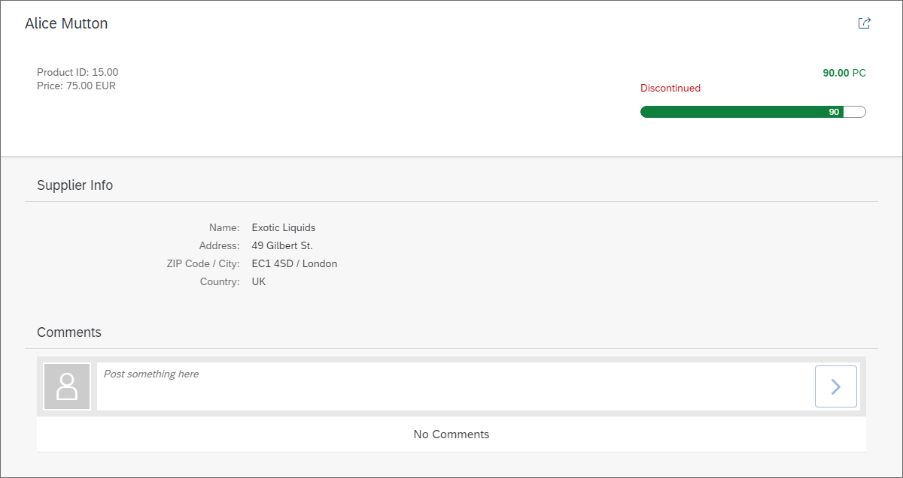

<!-- loio6a6a621c978145ad9eef2b221d2cf21d -->

| loio |
| -----|
| 6a6a621c978145ad9eef2b221d2cf21d |

view on: [demo kit nightly build](https://openui5nightly.hana.ondemand.com/#/topic/6a6a621c978145ad9eef2b221d2cf21d) | [demo kit latest release](https://openui5.hana.ondemand.com/#/topic/6a6a621c978145ad9eef2b221d2cf21d)

## Worklist App

In this tutorial we will build an app using OpenUI5 that, for example, a shop owner can use to manage his product stock levels.

The app provides the following features:

-   Overview of all products

-   Track products with shortages or products that are completely out of stock

-   Reorder products that are low in stock

-   View product details and add comments

We will use the worklist template as a starting point for this tutorial and add additional features to the app as we go through the steps. The template implements a typical "Worklist" floorplan, one of the patterns that are specified by the SAP Fiori design guidelines, but you can also use it as a starting point for easily creating any kind of list-based apps. For more information about worklist floorplans, see the *Related Information* section at the bottom of this topic.

***

### Preview

   
  
Start page of the app with list of products and actions<a name="loio6a6a621c978145ad9eef2b221d2cf21d__fig_swx_sgp_zt"/>

  

   
  
Product detail page of the app<a name="loio6a6a621c978145ad9eef2b221d2cf21d__fig_wnz_wgp_zt"/>

  

***

> Note:
> You don't have to do all tutorial steps sequentially, you can also jump directly to any step you want. Just download the code from the previous step, and start there.
> 
> You can view and download the files for all steps in the Demo Kit at [Worklist App](https://openui5.hana.ondemand.com/#/entity/sap.m.tutorial.worklist). Copy the code to your workspace and make sure that the application runs by calling the `webapp/index.html` file. Depending on your development environment you might have to adjust resource paths and configuration entries.
> 
> For more information check the following sections of the tutorials overview page \(see [Get Started: Setup, Tutorials, and Demo Apps](Get_Started_Setup,_Tutorials,_and_Demo_Apps_8b49fc1.md)\):
> 
> -   [Downloading Code for a Tutorial Step](Get_Started_Setup,_Tutorials,_and_Demo_Apps_8b49fc1.md#loio8b49fc198bf04b2d9800fc37fecbb218__tutorials_download)
> 
> -   [Adapting Code to Your Development Environment](Get_Started_Setup,_Tutorials,_and_Demo_Apps_8b49fc1.md#loio8b49fc198bf04b2d9800fc37fecbb218__tutorials_adaptation)
> 
> 
> 

**Related information**  

[SAP Fiori design guidelines: Worklist Floorplans](https://experience.sap.com/fiori-design/floorplans/work-list/)

[Worklist Template](Worklist_Template_a77f2d2.md)

